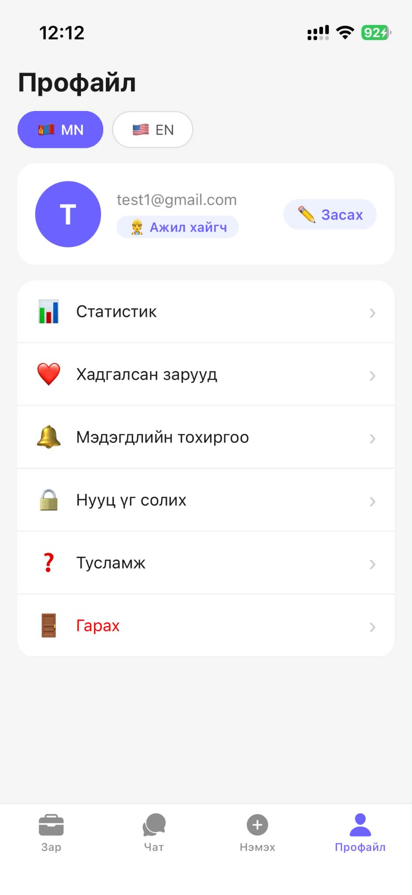

# FlexWork App

Mobile freelance/job finding application built with Expo React Native.

## Features

- Authentication
- Job posting
- Worker hiring
- Real-time UI
- Clean mobile design

## Tech Stack

- React Native
- Expo
- Supabase
- TypeScript

## Screenshots

<p align="center">
  
  
  
  
  
  
  
</p>

## Installation

```bash
npm install
npx expo start
